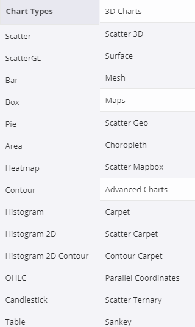

## 应用Dash到展示模块

关于dcc，包含的插件：

* Dropdown

* Slider

* RangeSlider

* Input

* Textarea

* Checkboxes

* Radio Items

* Button

* DatePickerSingle

* DatePickerRange

* Markdown

* Interactive Tables

* Upload Component

* Tabs

* Graphs

  其中Graph组件与plotly.py库共享相同的语法，查看Graph的figure属性支持的图：

  网址：https://plot.ly/python/reference/

  支持的figure图：

  

  感觉dash中调用的plotly.graph_objects中的这些图，主要还是数据分析，并不适用流程图

* 考虑到dash是基于plotly.py和react.py和Flask，去看看plotly.py有没有能用的

  可能可以用的图

  - https://plot.ly/python/network-graphs/     2D网图
  - https://plot.ly/python/tree-plots/    树图 可做进程图
  - https://plot.ly/python/3d-network-graph/    3D网图


### 使用3D网图来试试

* 需要安装igraph

  在windows上安装igraph不能直接通过`pip install python-igraph`命令来安装

  安装步骤：

  1. 在这个[网址](https://www.lfd.uci.edu/~gohlke/pythonlibs/)里下载对应python版本的igraph的whl文件

  2. 在命令行中pip安装刚刚下载的文件，文件名应该写全路径

     `pip install C:\Users\xxx\Downloads\python_igraph-0.7.1.post6-cp27-none-win32.whl`

* 运行示例代码时出现错误：

  ```
  Aw, snap! We don't have an account for ''. Want to try again? You can authenticate with your email address or username. Sign in is not case sensitive.
  Don't have an account? plot.ly
  ```


  PlotlyError: Because you didn't supply a 'file_id' in the call, we're assuming you're trying to snag a figure from a url. You supplied the url, '', we expected it to start with 'https://plot.ly'.
  ```

  出现错误的原因：没有得到plotly.py的认证文件

  获得方法：

  1. 在 [这里](https://plot.ly/feed/) 创建一个账号

  2. 在 [这里](https://plot.ly/settings/api) 获得API的key

  3. 在尝试获取图像前，输入这两行代码

  ```
     import plotly

     plotly.tools.set_credentials_file(username='dmbjzhh', api_key='PLUgUfiM4uDCSpOw66Yb')
     ```
    
     这样保证了可以接入plotly

  运行成功的结果：

  ```
  High five! You successfully sent some data to your account on plotly. View your plot in your browser at https://plot.ly/~dmbjzhh/0 or inside your plot.ly account where it is named 'Les-Miserables'
  ```

  但是需要去https://plot.ly/~dmbjzhh/0这个网址才能查看绘制好的图形

* 代码中用的是Scatter3D，去看reference：

  ```
  import plotly.graph_objs as go
  go.Scatter3D
  ```

  ​

* 示例中的json文件由node和link组成

  * 共有77个node，其中node中有两个key：
    * name
    * group：给node分类
  * link中有三个key：
    * source：源节点编号
    * target：目标节点编号
    * value

* 将示例代码，本来需要联网在plotly网页上运行的，修改后使它在本地也可以运行

* 发现散点图只有点，点对应的文字需要悬浮上才能显示，经查阅论坛后发现，把mode改为`mode='markers+text'`，即可，要是想改变文字显示的位置，可以试试`textposition='bottom`


#### 对于展示模块

json文件分为res0.json，和后续的diff.json文件

对于res0.json，层级关系是：

* links[]
  * source
  * target_group
  * 有的有group
  * target
  * source_group

对于diff.json，层级关系是：

* links_add[]
  * source
  * target_group
  * 有的有group
  * target
  * source_group
* nodes_remove[]
  * group
  * name
* nodes_add[]
  * group
  * name
* links_remove[]
  * source
  * target_group
  * 有的有group
  * target
  * source_group

#### 原项目的展示模块

定义了edge，node，text，force，node[]，links[]

对于res0.json：

* 获取link中的source作为name
* link中的source_group作为group
* 获取link中的target作为name
* link中的target_group作为group

#### 设计

输入：links的四个key

输出：

* 一个nodes数组，数组每个元素都是字典，字典中包含两个key：group和name
  * 其中name不重复，需要在生成数组时注意
    * 判断元素是否存在：定义一个flag，和一个label数组来存放不重复的name，每读取一个字典，用`in`来判断某个字符串是否存在于label数组中，如果存在，就不append到nodes数组中，如果不存在，则append到nodes数组中
  * links.source和links.target都是节点，都要放入nodes数组中
* ~~一个links数组，数组每个元素都是字典，字典包含两个key：source和target~~
  * ~~其中source和target对应于node数组的元素序号~~
  * ~~在生成nodes数组的时候一并生成~~
  * ~~用index('str')可以返回元素在列表中所在位置~~


* 一个Edges数组，数组每个元素都是元组，元组内是source和target的元组对
  * 用index('str')可以返回元素在列表中所在位置

定义一个函数，输入是一个字典data\['link']\[k]

* 功能：往nodes数组append元素

定义另一个函数generate_edges：

- 通过在labels中索引字典名字对应的位置，构建(source, target)元组对

### 结果


#### 项目可能用得上的属性

marker：

* 对于size，可以考虑

  * sizeref和sizemode

    用法：

    ```
    sizeref = 2*max(df_2007['size'])/(60**2)
    trace1 = go.Scatter(
        mode='markers',
        name='Americas',
        marker=dict(
            sizemode='area',
            sizeref=sizeref,
            size=df_2007['size'][df_2007['continent'] == 'Americas'],
            line=dict(
                width=2
            ),
        )
    ```

    ​

  * sizesrc

* colorsrc


#### 进一步改进

* marker显示文字以后，整个图特别乱，文字太多，要设置成特定元素有文字，根节点就不要文字了
* 用size区分结点
* 给按钮加回调函数使其动态显示

#### 还存在的问题

~~查阅文档后，发现marker不能直接在旁边显示相应文字说明，要鼠标放上去才能出现~~

鼠标滑过的文本框的样式还是大同小异，只能改改背景颜色、边框颜色、字体等

#### 关于python读写json文件

json在python中由list和dict组成，即json 是 k-v结构的形式,

简单来说， 如果是一个key,对应一个value.中间用 : 分隔，最外面用{}包围， 不同键值对之间用逗号，隔开

{‘key1’: 'value1', 'key2': 'value2', 'key3': 'value3'}

如果有一个Key对应着多个value的情况，用[]把对应的所有value包括起来。

{'key1': ['v11', 'v12', 'v13'], 'key2':'v22'}


json模块提供了四个功能：dumps、dump、loads、load


#### 关于layout可用的属性

['angularaxis', 'annotations', 'autosize', 'bargap', 'bargroupgap',

​    'barmode', 'barnorm', 'boxgap', 'boxgroupgap', 'boxmode', 'calendar',

​    'direction', 'dragmode', 'font', 'geo', 'height', 'hiddenlabels',

​    'hiddenlabelssrc', 'hidesources', 'hoverlabel', 'hovermode', 'images',

​    'legend', 'mapbox', 'margin', 'orientation', 'paper_bgcolor',

​    'plot_bgcolor', 'radialaxis', 'scene', 'separators', 'shapes',

​    'showlegend', 'sliders', 'smith', 'ternary', 'title', 'titlefont',

​    'updatemenus', 'width', 'xaxis', 'yaxis']

#### Figure层级

```
data []
	trace {}
		x, y, z[]
		color, text, size []
		colorscale ABC or []
		marker{}
			color ABC
			symbol ABC
			line{}
				color ABC
				width 123

layout{}
	title ABC
	xaxis, yaxis{}
	scene{}
		xaixs, yaxis, zaxis{}
	geo{}
	legend{}
	annotations{}
	
{} = dictionary
[] = list
ABC = string
123 = number
```

